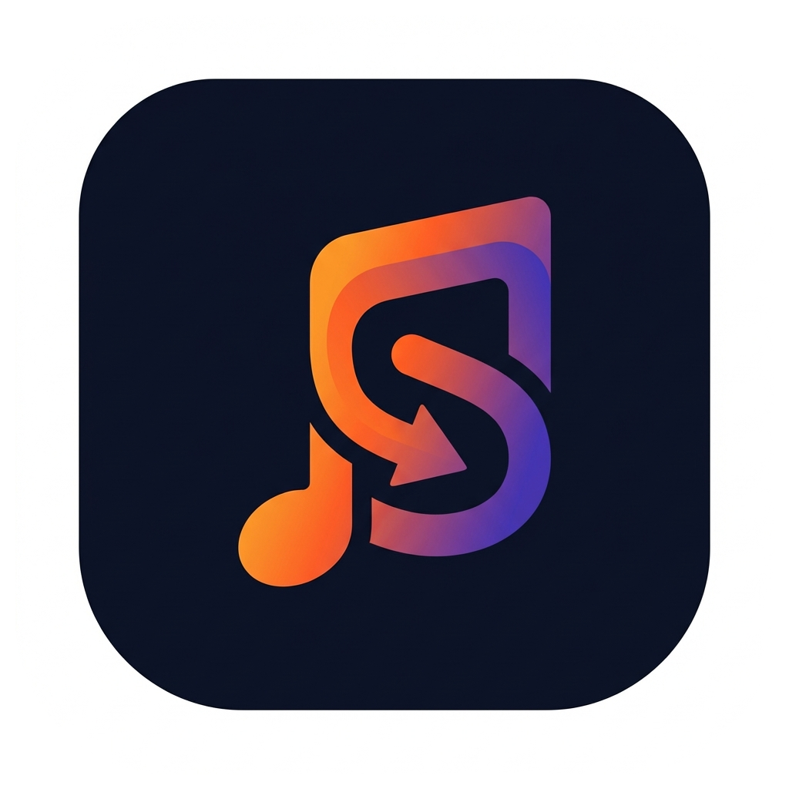

# ⚠️⚠️⚠️ Warning ⚠️⚠️⚠️

## ‼️‼️‼️

## This project is currently in development and is not ready for production use. I am not responsible for any damage or loss of data that may occur as a result of using this project.

## ‼️‼️‼️

### StudioSync

<div align="center">
  
  <h3>Sync your music studio, students, and schedule — all in one place.</h3>
  <p>An open-source, self-hosted alternative to My Music Staff, built for the modern music educator.</p>
  
  [](https://www.gnu.org/licenses/gpl-3.0)
  [](https://nextjs.org/)
  [](https://www.djangoproject.com/)
  [](https://www.docker.com/)
</div>

---

## ✨ Features

### 🎓 Student & Family Management

- **Comprehensive Student Profiles** - Track instrument, skill level (Beginner → Professional), enrollment status, and progress
- **Family Account Linking** - Connect parents and students for shared billing and communication
- **Band/Ensemble Organization** - Create groups with photo uploads, member management, and genre tracking
- **Emergency Contacts** - Store medical information and emergency contact details
- **Enrollment History** - Track lesson counts and student journey over time

### 📅 Intelligent Scheduling & Lessons

- **Smart Calendar System:**
  - Recurring lesson patterns (weekly, bi-weekly, monthly)
  - Automatic conflict detection to prevent double-bookings
  - Online and in-person lesson support
  - Cancellation, rescheduling, and makeup lesson management
  - No-show tracking and status management
- **Rich Lesson Documentation:**
  - Detailed lesson notes with practice assignments
  - Progress ratings (1-5 scale) and repertoire tracking
  - File attachments (audio, video, PDFs)
  - Strengths and improvement area documentation
  - Student and parent visibility controls
- **Reusable Lesson Plans:**
  - Template library for common lesson structures
  - Skill level targeting and duration tracking
  - Resource attachments and tag-based organization
  - Public/private sharing between teachers

### 💰 Billing & Financial Management

- **Automated Invoicing:**
  - Auto-generate invoices from completed lessons
  - Band-level consolidated billing
  - Multiple line items with tax calculation
  - Invoice status tracking (Draft, Sent, Paid, Partial, Overdue, Cancelled)
- **Flexible Payment Processing:**
  - Support for 8+ payment methods (Cash, Check, Credit/Debit Card, ACH, Venmo, PayPal, Zelle)
  - Payment history and transaction tracking
  - Partial payment support with balance calculations
  - Refund tracking and management
- **Financial Intelligence:**
  - Automated late fee calculation
  - Overdue invoice detection and alerts
  - Saved payment methods for recurring billing
  - Professional invoice generation with studio branding

### 📦 Inventory & Resource Management

- **Physical Inventory Tracking:**
  - Manage instruments, equipment, sheet music, and accessories
  - Condition monitoring (Excellent, Good, Fair, Needs Repair)
  - Status management (Available, Checked Out, Maintenance, Retired)
  - Location tracking with serial numbers and values
  - Purchase date and maintenance history
  - Low stock alerts for consumables
- **Student Checkout System:**
  - Approval workflow for item borrowing
  - Due date management with overdue detection
  - Quantity tracking for multiple copies
  - Damage reporting and return notes
  - Automated availability updates
- **Digital Resource Library:**
  - File sharing (PDFs, audio, video, images, sheet music)
  - External link management for online resources
  - Tag-based organization and categorization
  - Student-specific or public resource sharing
  - File size and MIME type tracking
- **Practice Room Reservations:**
  - Room capacity and equipment tracking
  - Hourly rate management with automated cost calculation
  - Reservation scheduling with conflict detection
  - Payment tracking for room usage
  - No-show tracking and status management

### 💬 Communication & Notifications

- **In-App Messaging:**
  - Thread-based conversations between teachers, students, and parents
  - Multi-participant support for group discussions
  - File attachments and rich content
  - Read/unread tracking for accountability
  - Subject/topic organization
- **Multi-Channel Notification System:**
  - Email, SMS, In-App, and Push notification support
  - Automated lesson reminders to reduce no-shows
  - Invoice and payment notifications
  - Lesson cancellation/rescheduling alerts
  - Resource sharing notifications
  - System announcements and updates
  - Clickable action URLs for quick access

### 🎯 Goals & Progress Tracking

- **Student Goal Management:**
  - Individual goal setting with target dates
  - Progress percentage tracking (0-100%)
  - Goal status management (Active, Achieved, Abandoned)
  - Notes and milestone documentation
  - Teacher and student collaboration on objectives

### 📊 Analytics & Reporting

- **Real-Time Dashboard:**
  - Customizable widget layout with drag-and-drop
  - Quick stats (Students, Lessons, Revenue, Attendance)
  - Upcoming lessons overview
  - Recent activity feed
  - At-a-glance studio health metrics
- **Comprehensive Reports:**
  - Student progress reports with custom date ranges
  - Financial reports with revenue tracking
  - Attendance and lesson completion reports
  - CSV and Excel export functionality (ExcelJS)
  - Filterable and sortable data views

### 🏢 Studio Management

- **Multi-Tenancy Support:**
  - Multiple studio/school profiles
  - Subdomain support for branded access
  - Custom branding (logo, colors, business info)
  - Timezone and currency settings
  - Business hours and contact information
- **Interactive Studio Layout Editor:**
  - 2D canvas designer powered by React-Konva
  - Drag-and-drop room planning
  - Item library (Instruments, Furniture, Equipment, Rooms)
  - Rotation, resizing, and locking controls
  - Save and print studio blueprints
  - Desktop-optimized with mobile notice
- **Teacher Management:**
  - Teacher profiles with specializations and bios
  - Hourly rate configuration
  - Availability settings and scheduling preferences
  - Booking buffer management
  - Qualifications and experience tracking

### 📋 Project & Task Management

- **Kanban Board:**
  - Visual task organization with drag-and-drop
  - Status columns (To Do, In Progress, Done)
  - Task details, descriptions, and assignments
  - Project tracking for studio initiatives
  - Color-coded priorities

### 🎨 Design System & Customization

- **Dynamic Theming:**
  - 8+ color scheme options (Teal, Blue, Indigo, Purple, Pink, Red, Orange, Green)
  - Real-time theme switching without page reload
  - Earth tone palette (Terracotta, Olive, Sage)
  - Dark mode support (coming soon)
- **Appearance Customization:**
  - Adjustable font sizes for accessibility
  - Compact mode for information density
  - Custom CSS variable system
  - Premium glassmorphism UI effects
  - Modern dialog and modal components
- **Responsive Design:**
  - Mobile-first approach for on-the-go access
  - Tablet optimization for teaching scenarios
  - Desktop power features for administration
  - Touch-friendly interfaces throughout

### 🔐 Security & Access Control

- **Authentication:**
  - Email-based secure authentication
  - Password management and recovery
  - Session handling and timeout
- **Role-Based Permissions:**
  - Four distinct roles (Admin, Teacher, Student, Parent)
  - Granular permission controls
  - Tailored dashboards per role
  - Secure API endpoints with authentication

### 🐳 Deployment & Infrastructure

- **One-Command Docker Deployment:**
  - Fully containerized with Docker Compose (v2 recommended)
  - PostgreSQL database for data, caching, and task management
  - Django Q for background tasks
  - Production-ready configuration

## 🚀 Quick Start

### Prerequisites

- Docker and Docker Compose
- Node.js >= 20.9.0 (for local frontend development)
- Python 3.11+ (for local backend development)

### Installation (Docker Compose)

1. **Clone the repository**

   ```bash
   git clone https://github.com/fddl-dev/studiosync.git
   cd studiosync
   ```

2. **Launch Services**

   ```bash
   docker compose up -d
   ```

3. **Initialize Database**

   ```bash
   docker compose exec backend python manage.py migrate
   docker compose exec backend python manage.py createsuperuser
   ```

4. **Access the App**
   - **Frontend:** [http://localhost:3000](http://localhost:3000)
   - **API Docs:** [http://localhost:8000/api/docs](http://localhost:8000/api/docs)
   - **Admin Portal:** [http://localhost:8000/admin](http://localhost:8000/admin)

## 🛠️ Tech Stack

### Frontend

- **Framework:** Next.js 16 (App Router)
- **Styling:** Tailwind CSS + Vanilla CSS
- **State/Data:** React Query + Context API
- **Icons:** Lucide React
- **Animations:** Framer Motion
- **Interactivity:** dnd-kit (Dashboard), React-Konva (Studio Editor)
- **Charts:** Recharts
- **Reports:** ExcelJS (Excel export)

### Backend

- **Framework:** Django 5.0 + Django REST Framework
- **Database:** PostgreSQL (Data, Cache, Background Tasks)
- **Real-time:** Django Channels (InMemoryChannelLayer)

## 📂 Project Structure

```
studiosync/
├── backend/            # Django REST API & Core Logic
│   ├── config/        # Settings & URL routing
│   ├── apps/          # Modular apps (students, lessons, billing, etc.)
│   └── scripts/       # Utility scripts
├── frontend/           # Next.js Application
│   ├── app/           # App Router (Pages & Layouts)
│   ├── components/    # Reusable UI components
│   ├── contexts/      # Authentication & Appearance state
│   └── services/      # API communication layer
├── docs/               # Technical documentation
├── scripts/            # Deployment & maintainance scripts
└── docker-compose.yml  # Container orchestration
```

## 🎨 Design System

StudioSync features a custom-built design system focused on performance and clarity:

- **Dynamic Theming:** Users can choose their accent color (Teal, Blue, Indigo, Purple, Pink, Red, Orange, Green) in real-time.
- **Glassmorphism:** Subtle blur effects and elevated surfaces for a modern feel.
- **Mobile-First:** Every page is designed primarily for mobile usage without sacrificing desktop power.

## 🤝 Contributing

We welcome contributions of all kinds!

1. Check the [Roadmap](ROADMAP.md) for upcoming tasks.
2. Fork the repo and create your feature branch: `git checkout -b feature/cool-feature`.
3. Submit a Pull Request.

## 📄 License

Distributed under the GPL-3.0 License. See `LICENSE` for more information.

---

<div align="center">
  Made with ❤️ by the StudioSync Team
</div>
